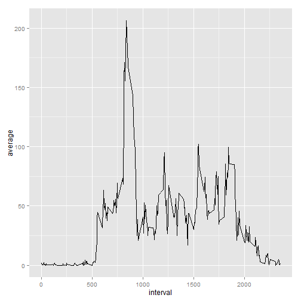
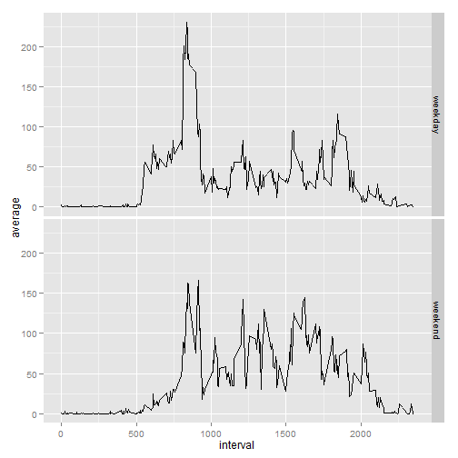

# Reproducible Research: Peer Assessment 1


## Loading and preprocessing the data

Cargamos las librerias necesarias.

```r
library("plyr")
library("ggplot2")
library("timeDate")
```

Ahora cargamos los datos, tambien creo un set de datos sin NA.

```r
activity<-read.csv("data/activity.csv")
activitywithoutNa<-activity[!is.na(activity$steps),]
```

## What is mean total number of steps taken per day?
Primero agrupo los pasos por dia y luego grafico un histograma para mostrar la distribucion del numero total de pasos por dia. 

```r
totalStepDay<-ddply(activitywithoutNa,.(date),summarise,totalSteps=sum(steps))
m <- ggplot(totalStepDay, aes(x=totalSteps))
m + geom_histogram()
```

 
 
Por ultimo calculo el promedio y la mediana de la variable que representa el total de pasos por dia.

```r
mean(totalStepDay$totalSteps)
```

```
## [1] 10766
```

```r
median(totalStepDay$totalSteps)
```

```
## [1] 10765
```

## What is the average daily activity pattern?
Primero calculo los el promedio de pasos por cada intervalo y luego grafico una serie de tiempo para mostrar el patron de actividad diario.

```r
averageStepInterval<-ddply(activitywithoutNa,.(interval),summarise,average=mean(steps))
m <- ggplot(averageStepInterval, aes(x=interval,y=average))
m + geom_line()
```

 

y por ultimo muestro el intervalo con mayor promedio de pasos.

```r
averageStepInterval[which.max(averageStepInterval$average),1]
```

```
## [1] 835
```

## Imputing missing values
La cantidad total de NA en el data set

```r
sum(is.na(activity$steps))
```

```
## [1] 2304
```
Tome como estrategia de rellenado de NA el promedio de pasos de cada intervalo y luego creo un nuevo set de datos pero con los NA rellenados atraves de la estrategia seleccionada.

```r
activityCompleted<-join(activity, averageStepInterval, by = "interval", type = "left", match = "all")
activityCompleted[is.na(activity$steps),]$steps<-activityCompleted[is.na(activity$steps),4]
```
a continuacion muestro las 5 primeras filas del set de datos generado.

```r
head(activityCompleted)
```

```
##     steps       date interval average
## 1 1.71698 2012-10-01        0 1.71698
## 2 0.33962 2012-10-01        5 0.33962
## 3 0.13208 2012-10-01       10 0.13208
## 4 0.15094 2012-10-01       15 0.15094
## 5 0.07547 2012-10-01       20 0.07547
## 6 2.09434 2012-10-01       25 2.09434
```
calculo el numero total de pasos por dia pero con el nuevo data set y realizo un histograma.

```r
totalStepDayAcCompleted<-ddply(activityCompleted,.(date),summarise,totalSteps=sum(steps))
m <- ggplot(totalStepDayAcCompleted, aes(x=totalSteps))
m + geom_histogram()
```

 

la media y la mediana del total de pasos por dia son:

```r
mean(totalStepDayAcCompleted$totalSteps)
```

```
## [1] 10766
```

```r
median(totalStepDayAcCompleted$totalSteps)
```

```
## [1] 10766
```

Se observa que la media obtendia es igual a la anterior calculada donde no se utilizo una estrategia de relleno y la mediana solo difiere en 1 de la tambien calcualda anteriormente.

Tamebien se observa que no tuvo impacto el rellenado de NA en la estimacion del numero total de pasos por dia.

## Are there differences in activity patterns between weekdays and weekends?
Primero creo una variable con los valores "weekday" y "weekend".

```r
activityCompleted$date<-as.Date(as.character(activityCompleted$date))
activityCompleted$partOfWeek[isWeekend(activityCompleted$date)]<-"weekend"
activityCompleted$partOfWeek[!isWeekend(activityCompleted$date)]<-"weekday"
activityCompleted$partOfWeek<-as.factor(activityCompleted$partOfWeek)
```
luego calculo el promedio de pasos por intervalo para los "weekend" y para los "weekday"  y grafico la serie de tiempo para mostrar los patrones de actividad en los "weekend" y los "weekday" .


```r
averageStepIntervalOfWeek<-ddply(activityCompleted,.(partOfWeek,interval),summarise,average=mean(steps))
m <- ggplot(averageStepIntervalOfWeek, aes(x=interval,y=average))
m + geom_line() + facet_grid(partOfWeek ~ . )
```

 

