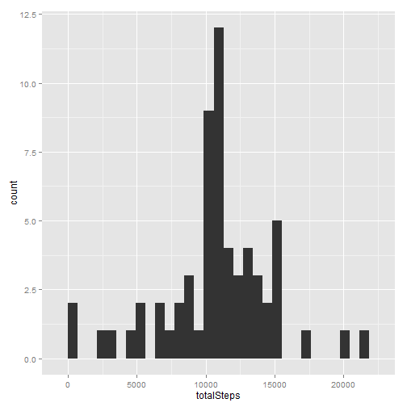

# Reproducible Research: Peer Assessment 1


## Loading and preprocessing the data

I load libraries.

```r
library("plyr")
library("ggplot2")
library("timeDate")
```


I load the data and I build a new data set without missing values(NA).

```r
activity <- read.csv("data/activity.csv")
activitywithoutNa <- activity[!is.na(activity$steps), ]
```

The data set look like this:

```r
head(activity)
```

```
##   steps       date interval
## 1    NA 2012-10-01        0
## 2    NA 2012-10-01        5
## 3    NA 2012-10-01       10
## 4    NA 2012-10-01       15
## 5    NA 2012-10-01       20
## 6    NA 2012-10-01       25
```


## What is mean total number of steps taken per day?
Firstly, I compute the total number of steps per day and then I make a histogram of the total number of steps taken each day. It show the distribution for this variable.

```r
totalStepDay <- ddply(activitywithoutNa, .(date), summarise, totalSteps = sum(steps))
m <- ggplot(totalStepDay, aes(x = totalSteps))
m + geom_histogram()
```

 

 
I compute the mean and the median of the total number of steps taken each day.

```r
mean(totalStepDay$totalSteps)
```

```
## [1] 10766
```

```r
median(totalStepDay$totalSteps)
```

```
## [1] 10765
```


## What is the average daily activity pattern?
Firstly, I compute the average of steps taken each interval and then I make time serie to show the average daily activity pattern.

```r
averageStepInterval <- ddply(activitywithoutNa, .(interval), summarise, average = mean(steps))
m <- ggplot(averageStepInterval, aes(x = interval, y = average))
m + geom_line()
```

 


Here I show the interval with the highest number of steps.

```r
averageStepInterval[which.max(averageStepInterval$average), 1]
```

```
## [1] 835
```


## Imputing missing values
Here I compute and report the total number of missing values in the dataset.

```r
sum(is.na(activity$steps))
```

```
## [1] 2304
```

I use the mean of steps per interval to fill the missing values in the dataset and then I build a new dataset that is equal to the original dataset but with the missing data filled in.

```r
activityCompleted <- join(activity, averageStepInterval, by = "interval", type = "left", 
    match = "all")
activityCompleted[is.na(activity$steps), ]$steps <- activityCompleted[is.na(activity$steps), 
    4]
```


The new datset look like this:

```r
head(activityCompleted)
```

```
##     steps       date interval average
## 1 1.71698 2012-10-01        0 1.71698
## 2 0.33962 2012-10-01        5 0.33962
## 3 0.13208 2012-10-01       10 0.13208
## 4 0.15094 2012-10-01       15 0.15094
## 5 0.07547 2012-10-01       20 0.07547
## 6 2.09434 2012-10-01       25 2.09434
```


With the new data set, I compute the total number of steps per day and then I make a histogram of the total number of steps taken each day. It show the distribution for this variable.

```r
totalStepDayAcCompleted <- ddply(activityCompleted, .(date), summarise, totalSteps = sum(steps))
m <- ggplot(totalStepDayAcCompleted, aes(x = totalSteps))
m + geom_histogram()
```

 


The mean and the meadia for total steps per day are:

```r
mean(totalStepDayAcCompleted$totalSteps)
```

```
## [1] 10766
```

```r
median(totalStepDayAcCompleted$totalSteps)
```

```
## [1] 10766
```

*The mean is equal to the estimate from the dataset without missing values and the median only differ in 1 with the estimates from the other data set.*


## Are there differences in activity patterns between weekdays and weekends?
Firstly, I build a new variable whit two values "weekend" and "weekday"

```r
activityCompleted$date <- as.Date(as.character(activityCompleted$date))
activityCompleted$partOfWeek[isWeekend(activityCompleted$date)] <- "weekend"
activityCompleted$partOfWeek[!isWeekend(activityCompleted$date)] <- "weekday"
activityCompleted$partOfWeek <- as.factor(activityCompleted$partOfWeek)
```

Then I compute the average of steps per interval on weekend days and also on weekday days. Moreover, I make time serie to show the average daily activity pattern on "weekend" and "weekday" 

```r
averageStepIntervalOfWeek <- ddply(activityCompleted, .(partOfWeek, interval), 
    summarise, average = mean(steps))
m <- ggplot(averageStepIntervalOfWeek, aes(x = interval, y = average))
m + geom_line() + facet_grid(partOfWeek ~ .)
```

 


